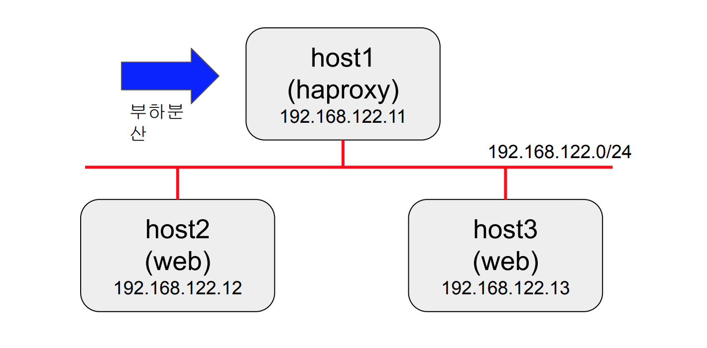

# Ansible-Exam

## Setting before exam

### Nodes
- PC OS: Ubuntu(Controller)
- host1 - CentOS7 (managed)
    - user, user
- host2 - CentOS7 (managed)
    - user, user
- host3 - Ubuntu 18.04 (managed)
    - devops, dkagh1.

### SSH key Authentication
```yaml
- inventory.ini

[web]
host1 ansible_user=user ansible_password=user ansible_become_password=user
host2 ansible_user=user ansible_password=user ansible_become_password=user

[db]
host3 ansible_user=devops ansible_password=dkagh1. ansible_become_password=dkagh1.

- ansible.cfg

[defaults]
inventory=inventory.ini
host_key_checking=false

- key.yml
---
- hosts: all
  tasks:
  - name: Allow user to login any host with ansible's account
    authorized_key:
      user: user
      state: present
      key: "{{ lookup('file', '/home/student/.ssh/id_rsa.pub')}}"
    when: ansible_facts.distribution == "CentOS"
  - name: Allow user to login any host with ansible's account
    authorized_key:
      user: devops
      state: present
      key: "{{ lookup('file', '/home/student/.ssh/id_rsa.pub')}}"
    when: ansible_facts.distribution == "Ubuntu"
```

### Remove sudo password

```yaml
- inventory.ini

[web]
host1 ansible_user=user ansible_password=user ansible_become_password=user
host2 ansible_user=user ansible_password=user ansible_become_password=user

[db]
host3 ansible_user=devops ansible_password=dkagh1. ansible_become_password=dkagh1.

- ansible.cfg

[defaults]
inventory=inventory.ini
host_key_checking=false
For CentOS
cp_cent.yml

---
- name: cp nopasswd file for no sudo passwd
  hosts: web
  become: yes
  tasks:
    - copy:
        src: nopasswd
        dest: /etc/sudoers.d/

* nopasswd file
user ALL=(ALL) NOPASSWD: ALL

For Ubuntu
cp_ubuntu.yml
---
- name: cp nopasswd file for no sudo passwd
  hosts: db
  become: yes
  tasks:
    - copy:
        src: nopasswd_devops
        dest: /etc/suoers.d/

 * nopasswd_ubuntu
devops ALL=(ALL) NOPASSWD: ALL

완료 후 확인
- inventory.ini
[web]
host1 ansible_user=user
host2 ansible_user=user

[db]
host3 ansible_user=devops

$ ansible all -a id -b
```
---

## Exam


```bash
1. host1에 haproxy 서비스를 설치하세요.
2. haproxy의 설정 파일은 http://cccr3guro.iptime.org/ansible/EXAM/haproxy.cfg.j2
에서 다운로드 받아서 template 모듈로 배포하세요.
3. 다운로드 받은 템플릿 파일의 ????은 적당한 변수로 변경해야 합니다.
4. host2는 CentOS host3은 Ubuntu입니다. 아파치 서비스를 각각 설치하고
index.html 에는 각 서버의 호스트네임이 들어가야합니다. 예를 들어 curl host2 를
하면 host2가 출력되어야 합니다.
5. 최종적으로 student$ curl host1 을 실행하면 host2와 host3이 교대로 출력되어야
합니다.
6. 정상 동작 기준으로
a. 플레이북만 사용해서 작성하면 50점부터 시작하여 감점
b. 롤을 사용해서 작성하면 100점부터 시작하여 감점
```
## Answer
- haproxy role
  - [haproxy tasks](./roles/haproxy/tasks/main.yml)
  - [haproxy template](./roles/haproxy/templates/haporxy.cfg.j2)
- web role
  - [web tasks)](./roles/web/tasks/)
  - [web template](./rolse/web/templates/index.html)

### result
```yaml
😕  exam git:(master) ✗ tree ~/Documents/Ansible/exam/
/home/student/Documents/Ansible/exam/
├── ansible.cfg
├── inventory.ini
├── roles
│   ├── haproxy
│   │   ├── defaults
│   │   │   └── main.yml
│   │   ├── files
│   │   ├── handlers
│   │   │   └── main.yml
│   │   ├── meta
│   │   │   └── main.yml
│   │   ├── README.md
│   │   ├── tasks
│   │   │   └── main.yml
│   │   ├── templates
│   │   │   └── haproxy.cfg.j2
│   │   ├── tests
│   │   │   ├── inventory
│   │   │   └── test.yml
│   │   └── vars
│   │       └── main.yml
│   └── web
│       ├── defaults
│       │   └── main.yml
│       ├── files
│       ├── handlers
│       │   └── main.yml
│       ├── meta
│       │   └── main.yml
│       ├── README.md
│       ├── tasks
│       │   ├── main.yml
│       │   ├── setup-centos.yml
│       │   └── setup-ubuntu.yml
│       ├── templates
│       │   └── index.html
│       ├── tests
│       │   ├── inventory
│       │   └── test.yml
│       └── vars
│           └── main.yml
└── webservers_haproxy_role.yml
```

host1에서 haproxy 동작 확인
